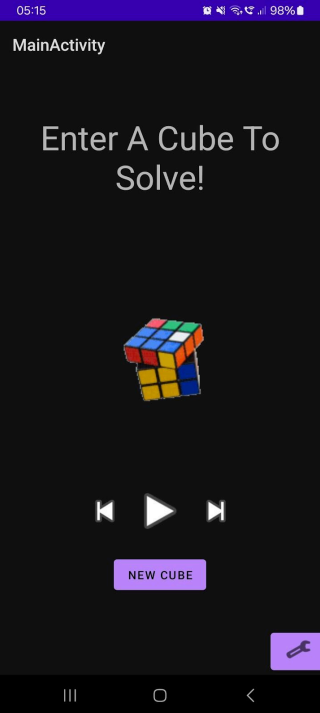
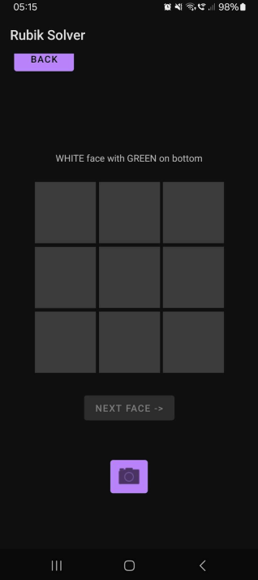
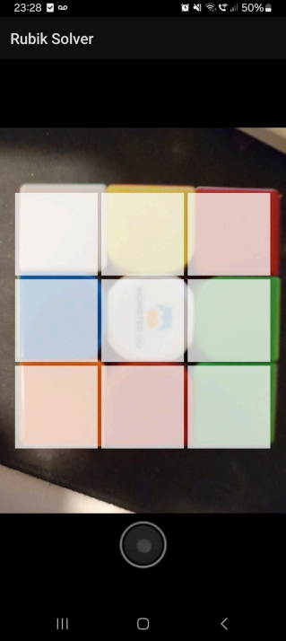
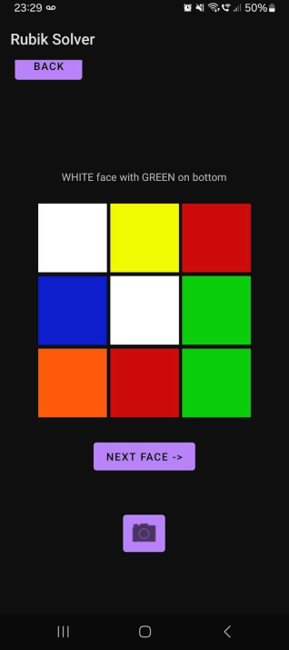
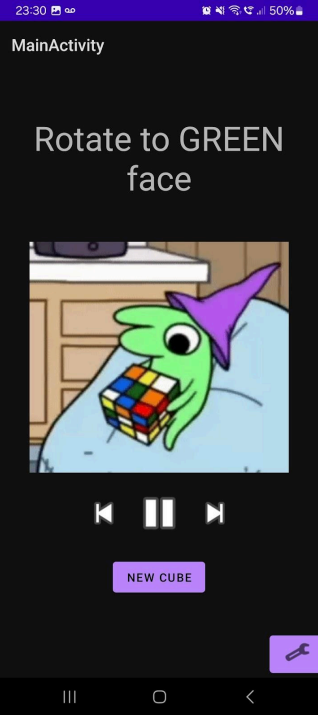
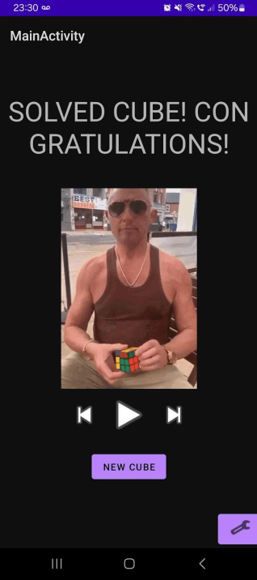
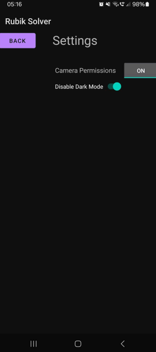

  

<h1 align="center">rubiks-solver</h1>
<h3 align="center">An Android Rubik's Cube Solver in Kotlin</h3>

  <a href="#about">About</a> •
  <a href="#images">Images</a> •
  <a href="#details">Details</a> •
  <a href="#further-work-and-contributions">Further Work & Contributions</a>

## About

rubiks-solver is an application written for Android in Kotlin using Android Studio that gives voiced commands to solve a Rubiks Cube after analysing the 6 images showing each side of the cube.

This project was for my final year Computer Science dissertation at the University of Liverpool (2025), recieving a 85% mark. I had never used Kotlin or Android Studio prior to this project and it helped me to learn a lot.

### Algorithm Used

No specific algorithm was used (simply peak into [Solver.kt](app/src/main/java/com/henry/rubiksolver/Solver.kt) to see the consequences of that decision). I had decided against using third party libraries and as such I had to develop the algorithm myself. To this end I would randomise the cube and then solve the Cube describing the rational behind each decision. It is fair to say that the algorithm therefore uses a mixed group of agorithms (largely using [CFOP](https://ruwix.com/the-rubiks-cube/how-to-solve-the-rubiks-cube-beginners-method/) with some more complex additional moves). All that being said, whilst the algorithm is capable of solving the cube (I went through many bugfixes!!), it does not do so efficiently taking far more moves than alternate algorithms would, although potentially less than the beginners method.

### Dissertation Paper
[Click to see the dissertation paper](.github/dissertation_paper_git.pdf) for deeper information and rational about the project.

> Note:
> I did forget to finish the acknowledgements page

## Images

### App Home Page

  

> Note: Press "New Cube" to enter a new cube (see [App Cube Input](#app-cube-input)) or press the settings wrench button at the bottom right to enter settings (see [Settings Page](#settings-page)).

### App Cube Input

  
  
  

> Note: Colours can be manually specified on the [Manual Input Page](.github/images/cube_input_page.png) by pressing each square, cycling through the colours or automatically identified using the [camera](.github/images/cube_cam_page.png).

### Cube Solving

  
  

> Note: Images shown are gifs which play alongside input & text is vocalised using an ai synthesised voice.

### Settings Page

  

> Note: Settings show dark/light mode options and revoking/granting camera permissions.

## Details

### Cube datastructure

### Colour Picker

After taking an image of the user's cube's face, the program takes a pixel's RBG value from each square and converts it to [HSV](https://en.wikipedia.org/wiki/HSL_and_HSV). It then uses the saturation value to determine if the square is white and if not then the colour value to accurately determine the square's colour.

> Note: if a colour is incorrectly determined then a user is able to either scan again or manually assign a square's colour.

### Algorithm

As described in the [About](#about) section, the project uses CFOP taking a mixture of a beginner method moves with various additional moves that I've picked up along the way.

See the [dissertation paper](.github/dissertation_paper_git.pdf) for more information.

## Further Work and Contributions

### Contributions

Feel free to use the work here as you wish, there is no need to reference the code.

### Further Work

The project would best be improved with:

1. Visualisations of the solving moves (e.g. a 3D animation showing the cube perform an R move, etc.)
2. Implementation of a standard solving algorithm 
3. Real human voices (as opposed to AI)

> Additionally I had originally intended to include the ability to solve differently sized cubes too (2x2, 4x4, 5x5), a feature which the app would be improved with. 
> The 2x2 might pose some difficulty but the 4x4 and 5x5 are essentially quirky 3x3s that would just add a couple steps (3x3 setup and final step correction) to a normal 3x3.

## License

MIT License — see [LICENSE](LICENSE) for details.
